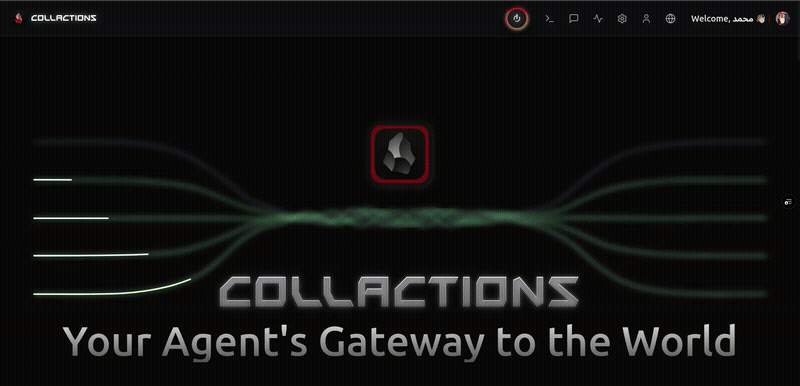

# أداة رسم الهيكلة - تطبيق الرسوم البيانية المتقدم

  <p align="center">
  
</p>

[](https://nextjs.org/)
[](https://typescriptlang.org/)
[](LICENSE)
[](https://tailwindcss.com/)

[](README.md)

[](https://github.com/your-repo/releases)

## نظرة عامة

أداة رسم الهيكلة هو تطبيق ويب متطور للرسوم البيانية مبني بـ Next.js و TypeScript، يتميز بالدعم الأصلي للغة العربية وقدرات الرسم المتقدمة. يوفر التطبيق تجربة حديثة وسلسة لإنشاء الرسوم البيانية المهنية والمخططات الانسيابية والتصورات الهيكلية مع ميزات محسنة بالذكاء الاصطناعي.

<p align="center">
  
</p>

## ✨ المميزات الرئيسية


<p align="right">
  
</p>


### 🎨 **محرك الرسم المتطور**
- **لوحة تفاعلية**: لوحة رسم عالية الأداء مع إمكانيات التكبير والتحريك
- **أشكال ذكية**: تمييز ذكي للأشكال ومحاذاة تلقائية
- **رسوم متجهة**: رسوم بيانية قائمة على المتجهات للعرض الواضح
- **إدارة الطبقات**: دعم متعدد الطبقات للرسوم البيانية المعقدة
# كولاكشنز — محرر رسوم بيانية ومجموعة أدوات مطورين مدعومة بالذكاء الاصطناعي

   <p align="center">
   
</p>

[](https://nextjs.org/)
[](https://typescriptlang.org/)
[](LICENSE)
[](https://tailwindcss.com/)

[](README.md)

كولاكشنز هو محرر رسوم بيانية متقدّم ومجموعة أدوات للمطورين مبنية باستخدام Next.js و TypeScript. يجمع بين محرر رسومي تفاعلي، مكتبة كبيرة من القوالب (جاهزة للعمل مع MCP)، تحسين وترجمة البروبتات بالذكاء الاصطناعي، خوارزميات ذكية لترتيب العناصر، كود بلوك متقدّم، إنشاء صور باستخدام نماذج ذكاء اصطناعي مجانية، ومحاكي تيرمينال واقعي (nano + zsh) — كل ذلك داخل واجهة رسبونسف ومتحرّكة.

<p align="center">
   
</p>

## ماذا يقدّم المشروع

- مكتبة واسعة من القوالب القابلة للتوسيع — القوالب متوافقة مع MCP ويمكن إدارتها من خلال نقاط نهاية `src/app/api/mcp/templates`.
- تحسين تلقائي للبروبتات (prompt) وترجمتها بين اللغات باستخدام الذكاء الاصطناعي قبل إرسالها إلى النماذج.
- خوارزميات ذكية لتنظيم العقد وتوزيعها تلقائيًا وتجنّب التصادمات.
- كود بلوك متقدّم يدعم شارات اللغة، ألوان رؤوس الأكواد، وعمليات النسخ/التشغيل.
- إمكانية إنشاء صور وأصول رسومية باستخدام نماذج ذكاء اصطناعي مجانية (قابلة للتكوين في طبقة AI).
- محاكي تيرمينال واقعي في `/terminal` يسمح بفتح وتحرير الملفات باستخدام أدوات شبيهة بـ `nano` ومحاكاة موجه `zsh`.
- مصادقة آمنة بواسطة Clerk لإدارة تسجيل الدخول والجلسات.

## المميزات الرئيسية

- القوالب ودعم MCP
   - مكتبة قوالب جاهزة ومتكاملة مع API الخاصة بـ MCP تحت `src/app/api/mcp`.
   - إمكانية إضافة قوالب جديدة ونشرها عبر واجهات MCP.

- تحسين وترجمة البروبتات بالذكاء الاصطناعي
   - مُحسّن البروبت يقوم بصياغة وتحسين الأوامر تلقائيًا.
   - ترجمة البروبتات بين اللغات لدعم التدفقات الدولية.

- خوارزميات ذكية
   - ترتيب تلقائي للعناصر، تجنّب التصادم، وتوجيه الحواف.
   - اقتراحات قالبية مبنية على محتوى المستخدم وسجلّه.

- كود بلوك متقدّم
   - شارات لغة، نسخ سريع، ودعم تشغيل/شرح الشيفرة عن طريق AI.

- إنشاء الصور
   - مولد صور مدمج يستخدم نماذج مجانية ومهيّأ عبر واجهات AI في المشروع.

- واجهة متجاوبة ومتحركة
   - مبنية على Tailwind CSS و Framer Motion لتجربة مرنة وجذّابة.

- محاكي التيرمينال
   - تجربة تحرير واقعية مع اختصارات مشابهة لـ `nano` ومحاكاة `zsh`.

- المصادقة
   - تسجيل دخول وآمان الجلسات عبر Clerk.

## تشغيل سريع

### المتطلبات

- Node.js >= 20
- pnpm
- Git

### التشغيل محليًا

```bash
git clone https://github.com/Msr7799/collactions.git
cd collactions
pnpm install
cp .env.example .env.local
# عدّل .env.local لتضع مفاتيح Clerk و (اختياري) مفاتيح الذكاء الاصطناعي
pnpm dev

# افتح http://localhost:3000
```

ملاحظات:
- تكامل MCP موجود في `src/lib/mcp.ts` ونقاط نهاية MCP تحت `src/app/api/mcp`.
- طبقة خدمات الذكاء الاصطناعي قابلة للتبديل ومُكوّنة عبر متغيرات البيئة. انظر `src/app/api/generate-image/route.ts` و `src/app/api/chat/*` للأمثلة.

## بنية المشروع (باختصار)

```
src/
├─ app/                # Next.js App Router (صفحات ونقاط API والتيرمينال)
├─ components/         # مكونات الواجهة (ai، layout، prompts، providers)
├─ contexts/           # سياقات React (LanguageContext، ThemeContext)
├─ lib/                # الأدوات والمساعدات (api، mcp، models، translations)
├─ config/             # تكوين MCP (`mcp-servers.json`)
└─ styles/             # CSS والخطوط
```

## ملفات مهمة

- `src/app/terminal/page.tsx` — محاكي التيرمينال وسلوك محرّر nano
- `src/app/prompts/CodeBlock.tsx` — واجهة الكود المتقدمة
- `src/app/api/mcp/templates/route.ts` — API قوالب MCP
- `src/lib/mcp.ts` — أدوات تكامل MCP

## متغيرات البيئة

ضع `.env.local` مع القيم التالية:

```env
NEXT_PUBLIC_CLERK_PUBLISHABLE_KEY=your_clerk_key
CLERK_SECRET_KEY=your_clerk_secret

# مفاتيح خدمات الذكاء الاصطناعي (اختياري)
OPENAI_API_KEY=your_openai_key
ANTHROPIC_API_KEY=your_anthropic_key

NEXT_PUBLIC_APP_URL=http://localhost:3000
```

## التقنيات المستخدمة

- Next.js (App Router)
- React 19 + TypeScript
- Tailwind CSS
- Framer Motion (الأنيمشن)
- Clerk (المصادقة)
- Model Context Protocol (MCP) (`@modelcontextprotocol/sdk`)
- تكامل مع نماذج ذكاء اصطناعي مجانية (قابلة للتكوين)
- Zustand (إدارة الحالة)
- Lucide، MUI للرموز/المكونات

## ملاحظات تطويرية

- خزّن وحرّر قوالب MCP في `src/app/api/mcp/templates` وحدث `config/mcp-servers.json` عند الحاجة.
- نظام اللغة يستخدم ملف تعريف cookie و`middleware.ts` للعمل بشكل صحيح مع SSR.
- أضف باك إند AI جديد عبر `src/lib/api.ts` ونقاط النهاية الآمنة داخل `src/app/api`.

## المساهمة

المساهمات مرحب بها — قم بعمل fork ثم فتح طلب سحب. حافظ على دعم اللغات والاختبارات.

## الترخيص

MIT — راجع ملف [LICENSE](LICENSE)

---

إذا أردت، أستطيع إضافة قسم صغير يوضّح كيف تكتب اختبارات، أوأوامر lint/test، وكيف تضيف قوالب MCP برمجياً.
### الرسم بمساعدة الذكاء الاصطناعي
