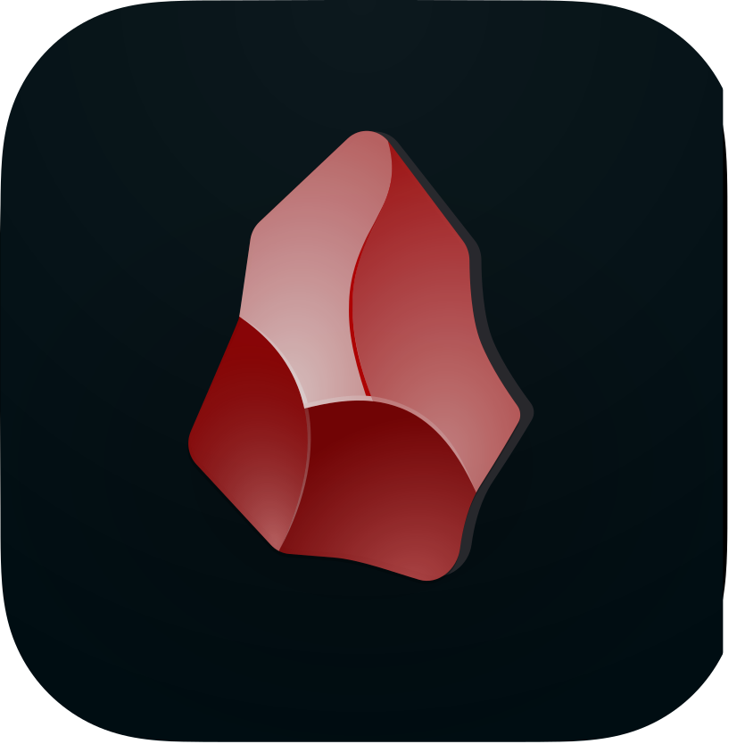
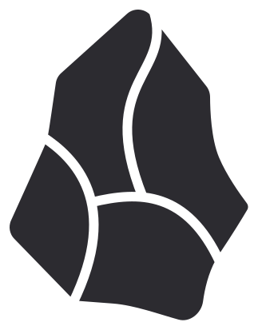

# أداة رسم الهيكلة - تطبيق الرسوم البيانية المتقدم

  <p align="center">
  
</p>
[](https://nextjs.org/)
[](https://typescriptlang.org/)
[](LICENSE)
[](https://tailwindcss.com/)

[](README.md)

[](https://github.com/your-repo/releases)

## نظرة عامة

أداة رسم الهيكلة هو تطبيق ويب متطور للرسوم البيانية مبني بـ Next.js و TypeScript، يتميز بالدعم الأصلي للغة العربية وقدرات الرسم المتقدمة. يوفر التطبيق تجربة حديثة وسلسة لإنشاء الرسوم البيانية المهنية والمخططات الانسيابية والتصورات الهيكلية مع ميزات محسنة بالذكاء الاصطناعي.

<div align="center">
  <table>
    <tr>
      <td align="center" style="padding: 50px;">
        
      </td>
      <td align="center" style="padding: 50px;">
        
      </td>
    </tr>
    <tr>
      <td align="center" style="padding: 50px;">
        
      </td>
      <td align="center" style="padding: 50px;">
        
      </td>
    </tr>
  </table>
</div>

## ✨ المميزات الرئيسية

[](FEATURES-ar.md)

<p align="right">
  
</p>


### 🎨 **محرك الرسم المتطور**
- **لوحة تفاعلية**: لوحة رسم عالية الأداء مع إمكانيات التكبير والتحريك
- **أشكال ذكية**: تمييز ذكي للأشكال ومحاذاة تلقائية
- **رسوم متجهة**: رسوم بيانية قائمة على المتجهات للعرض الواضح
- **إدارة الطبقات**: دعم متعدد الطبقات للرسوم البيانية المعقدة
- **الشبكة والإرشادات**: رسم دقيق مع وظيفة الالتقاط بالشبكة

### 🤖 **ميزات مدعومة بالذكاء الاصطناعي**
- **اقتراحات ذكية**: توصيات الأشكال والتخطيطات المدعومة بالذكاء الاصطناعي
- **التوليد التلقائي**: إنتاج الرسوم البيانية من الأوصاف النصية
- **المحادثة المحسنة**: مساعد ذكاء اصطناعي تفاعلي لإنشاء الرسوم البيانية
- **تمييز القوالب**: اقتراحات قوالب مدفوعة بالذكاء الاصطناعي
- **تحليل المحتوى**: تحليل وتحسين الرسوم البيانية الذكي

### 🌐 **الدعم ثنائي اللغة**
- **دعم أصلي للعربية**: تخطيط RTL كامل وعرض النصوص العربية
- **واجهة مزدوجة**: تبديل سلس للواجهة بين الإنجليزية والعربية
- **محتوى محلي**: محتوى متفهم للسياق بكلتا اللغتين
- **رسوم بيانية RTL**: دعم أصلي لتدفق الرسوم البيانية من اليمين إلى اليسار

### 🎨 **واجهة مستخدم حديثة**
- **الوضع المظلم/الفاتح**: ثيمات أنيقة مع تفضيلات المستخدم
- **تصميم متجاوب**: محسن لجميع أحجام الشاشات
- **تصميم متريال**: تصميم واجهة نظيف وبديهي
- **إمكانية الوصول**: امتثال كامل لـ WCAG 2.1

### 🔧 **أدوات احترافية**
- **خيارات التصدير**: تنسيقات تصدير متعددة (PNG, SVG, PDF, JSON)
- **مكتبة القوالب**: قوالب احترافية جاهزة
- **التعاون**: تحرير تعاوني في الوقت الفعلي
- **التحكم في الإصدارات**: إصدارات الرسوم البيانية والتاريخ
- **المزامنة السحابية**: مزامنة سحابية تلقائية

### 🔐 **الأمان والخصوصية**
- **مصادقة آمنة**: نظام تسجيل دخول آمن قائم على Clerk
- **تشفير البيانات**: تخزين بيانات مشفر من طرف إلى طرف
- **الخصوصية أولاً**: معالجة محلية مع مزامنة سحابية اختيارية
- **إدارة الأذونات**: ضوابط وصول دقيقة

## 🚀 البدء السريع

### المتطلبات المسبقة

- Node.js 18.0 أو أحدث
- pnpm 8.0 أو أحدث
- Git

### التثبيت

1. **استنساخ المستودع**
   ```bash
   git clone https://github.com/your-repo/structure-drawing-tool.git
   cd structure-drawing-tool
   ```

2. **تثبيت التبعيات**
   ```bash
   pnpm install
   ```

3. **تكوين متغيرات البيئة**
   ```bash
   cp .env.example .env.local
   # تحرير .env.local مع التكوين الخاص بك
   ```

4. **تشغيل خادم التطوير**
   ```bash
   pnpm dev
   ```

5. **فتح التطبيق**
   انتقل إلى [http://localhost:3000](http://localhost:3000)

## 📱 دعم المنصات

| المنصة | الحالة | ملاحظات |
|----------|--------|-------|
| الويب (سطح المكتب) | ✅ | دعم كامل |
| الويب (الهاتف المحمول) | ✅ | تصميم متجاوب |
| PWA | ✅ | قابل للعمل دون اتصال |
| Electron | 🔄 | قيد التطوير |

## 🏗️ بنية المشروع

```
src/
├── app/                        # Next.js 14 App Router
│   ├── api/                   # مسارات API
│   │   └── chat/             # نقاط نهاية محادثة الذكاء الاصطناعي
│   ├── dashboard/            # لوحة القيادة الرئيسية
│   ├── enhanced-chat/        # واجهة محادثة الذكاء الاصطناعي
│   └── prompts/             # إدارة أوامر الذكاء الاصطناعي
├── components/              # مكونات React
│   ├── ai/                 # المكونات المتعلقة بالذكاء الاصطناعي
│   ├── layout/            # مكونات التخطيط
│   └── prompts/          # مكونات الأوامر
├── contexts/             # سياقات React
│   └── LanguageContext.tsx # تبديل اللغة
├── lib/                 # مكتبات الأدوات المساعدة
│   ├── api.ts          # أدوات مساعدة API
│   ├── mcp.ts         # تكامل MCP
│   └── utils.ts      # أدوات مساعدة عامة
└── types/           # تعريفات أنواع TypeScript
```

## 🔧 التكوين

### متغيرات البيئة

أنشئ ملف `.env.local` مع المتغيرات التالية:

```env
# المصادقة
NEXT_PUBLIC_CLERK_PUBLISHABLE_KEY=your_clerk_key
CLERK_SECRET_KEY=your_clerk_secret

# خدمات الذكاء الاصطناعي
OPENAI_API_KEY=your_openai_key
ANTHROPIC_API_KEY=your_anthropic_key

# قاعدة البيانات
DATABASE_URL=your_database_url

# إعداد التطبيق
NEXT_PUBLIC_APP_URL=http://localhost:3000
```

### أدوات الرسم المتاحة

#### أدوات الأشكال
- **الأشكال الأساسية**: المستطيل، الدائرة، المثلث، الخط
- **المخطط الانسيابي**: العملية، القرار، الموصل، الطرفي
- **الشبكة**: الخادم، الموجه، قاعدة البيانات، السحابة
- **UML**: الفئة، التسلسل، حالة الاستخدام

#### ميزات الذكاء الاصطناعي
- **التخطيط الذكي**: تنظيم الرسوم البيانية التلقائي
- **النص إلى رسم بياني**: إنتاج الرسوم البيانية من الأوصاف
- **نقل الأسلوب**: تطبيق تنسيق متسق
- **اقتراحات المحتوى**: توصيات محتوى ذكية

## 🎯 الاستخدام

### إنشاء الرسم البياني الأساسي
1. قم بتشغيل التطبيق وتسجيل الدخول
2. اختر "رسم بياني جديد" من لوحة القيادة
3. اختر قالباً أو ابدأ فارغاً
4. استخدم شريط الأدوات لإضافة الأشكال والاتصالات
5. خصص التنسيق والخصائص

### الرسم بمساعدة الذكاء الاصطناعي
1. افتح لوحة محادثة الذكاء الاصطناعي
2. صف الرسم البياني الذي تريد إنشاؤه
3. سيولد الذكاء الاصطناعي اقتراحات وتخطيطات
4. قم بتحسين وتخصيص المحتوى المولد

### التعاون
1. شارك الرسم البياني مع أعضاء الفريق
2. مكّن وضع التعاون في الوقت الفعلي
3. شاهد المؤشرات والتغييرات المباشرة
4. استخدم التعليقات للملاحظات

### التصدير والمشاركة
1. انقر على زر التصدير في شريط الأدوات
2. اختر التنسيق المفضل (PNG/SVG/PDF)
3. قم بتكوين إعدادات التصدير
4. قم بتنزيل أو مشاركة الرسم البياني

## 🤝 المساهمة

نرحب بالمساهمات! يرجى اتباع هذه الخطوات:

1. قم بعمل Fork للمستودع
2. أنشئ فرع ميزة (`git checkout -b feature/amazing-feature`)
3. قم بتأكيد تغييراتك (`git commit -m 'Add amazing feature'`)
4. ادفع إلى الفرع (`git push origin feature/amazing-feature`)
5. افتح طلب سحب

### إرشادات التطوير

- اتبع أفضل ممارسات TypeScript
- حافظ على الدعم ثنائي اللغة (الإنجليزية/العربية)
- اكتب اختبارات شاملة
- حدث التوثيق
- تأكد من التصميم المتجاوب

## 📄 الترخيص

هذا المشروع مرخص تحت رخصة MIT - انظر ملف [LICENSE](LICENSE) للتفاصيل.

## 👨‍💻 المطور

**اسمك**
- 📧 البريد الإلكتروني: your.email@example.com
- 🌐 GitHub: [ملفك الشخصي على GitHub](https://github.com/yourusername)

## 🐛 تقارير الأخطاء وطلبات الميزات

إذا واجهت أي مشاكل أو لديك اقتراحات للتحسينات:

📧 **البريد الإلكتروني**: your.email@example.com

يرجى تضمين:
- معلومات المتصفح ونظام التشغيل
- خطوات إعادة إنتاج المشكلة
- السلوك المتوقع مقابل الفعلي
- لقطات شاشة (إن أمكن)

## 🙏 شكر وتقدير

- فريق Next.js للإطار المذهل
- OpenAI و Anthropic لقدرات الذكاء الاصطناعي
- Tailwind CSS لنظام التنسيق
- مساهمي المجتمع مفتوح المصدر

---

**أداة رسم الهيكلة** - تمكين التواصل البصري مع الرسوم البيانية الذكية

تم البناء بـ ❤️ للمجتمع العالمي
