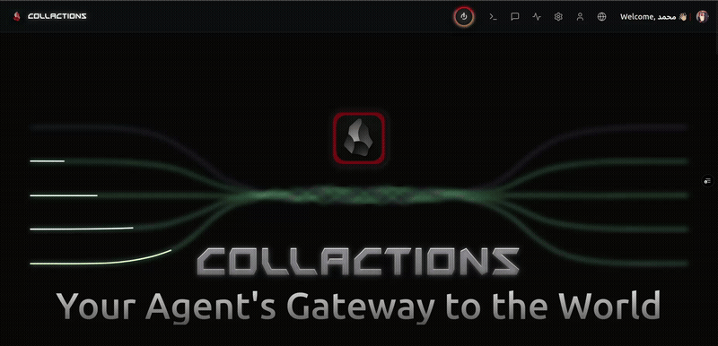

# Collactions — AI Gateway & Intelligent Chat Platform
   <p align="center">
   
</p>

[](https://nextjs.org/)
[](https://typescriptlang.org/)
[](LICENSE)
[](https://tailwindcss.com/)

[](README-ar.md)

Collactions is an advanced AI Gateway and intelligent chat platform built with Next.js and TypeScript. It provides unified access to multiple AI providers (OpenRouter, GPTGOD, Hugging Face), MCP server integration, AI-powered prompt enhancement & translation, advanced code blocks with syntax highlighting, free AI-based image generation, and a realistic terminal emulator (nano + zsh) — all inside a responsive, animated UI with Arabic/English support.

<p align="center">
   
</p>

## What this project provides

- **Multi-Provider AI Gateway**: Unified access to 54+ free AI models from OpenRouter, GPTGOD, and Hugging Face with automatic fallback and rate limiting.
- **MCP Server Integration**: Extensible Model Context Protocol servers including filesystem, git, memory, sequential-thinking, and more.
- **AI-Powered Chat Interface**: Advanced chat experience with prompt enhancement, translation between languages, and intelligent message processing.
- **Smart Code Handling**: Advanced code blocks with syntax highlighting, copy/download functionality, and fullscreen editing modes.
- **Free Image Generation**: AI-powered image creation using Hugging Face models with GPT-4o description enhancement.
- **Terminal Emulator**: Realistic terminal simulation with `nano` editor and `zsh` prompt for developer workflows.
- **Bilingual Support**: Full Arabic and English interface with intelligent language detection and translation.
- **Authentication**: Secure user management via Clerk with profile management and session persistence.

## Key Features

- **AI Model Management**
   - Access to 54+ free models from multiple providers with smart routing and fallback mechanisms.
   - Real-time model status monitoring and automatic error handling.
   - Custom model configurations and preferences per user.

- **MCP Server Ecosystem**
   - Filesystem operations, git integration, memory management, and sequential thinking capabilities.
   - Extensible server architecture with automatic discovery and tool integration.
   - Real-time server status monitoring and connection management.

- **Chat & Communication**
   - AI-powered prompt enhancement and automatic translation between Arabic and English.
   - Session persistence with automatic saving and chat history management.
   - Advanced message rendering with typing animations and rich content support.

- **Developer Tools**
   - Advanced code blocks with syntax highlighting, language detection, and copy/download functionality.
   - Integrated terminal emulator with nano editor and zsh prompt simulation.
   - Git integration and filesystem operations through MCP servers.

- **Image Generation**
   - Free AI-powered image creation using Hugging Face FLUX.1-dev model.
   - GPT-4o enhanced descriptions for better image quality.
   - Seamless integration within chat conversations.

- **Modern UI/UX**
   - Responsive design with Tailwind CSS and Framer Motion animations.
   - Dark/light theme support with smooth transitions.
   - Bilingual interface (Arabic/English) with RTL support.

- **Security & Performance**
   - Clerk-powered authentication with secure session management.
   - API rate limiting and automatic fallback mechanisms.
   - Environment-based configuration for secure API key management.
   - Optimized performance with React memoization and dynamic imports.

## Quickstart

### Requirements

- Node.js >= 20 (project `package.json` targets Node 20+)
- pnpm
- Git

### Run locally

```bash
git clone https://github.com/Msr7799/collactions.git
cd collactions
pnpm install
cp .env.example .env.local
# edit .env.local to provide your keys (Clerk, OpenAI/Anthropic if used)
pnpm dev

# Open http://localhost:3000
```

Notes:
- The app uses MCP integration under `src/lib/mcp.ts` and the MCP API routes in `src/app/api/mcp`.
- AI backends are pluggable and configured via environment variables. The project integrates with free model endpoints where possible — see `src/app/api/generate-image/route.ts` and `src/app/api/chat/*` for examples.

## Project Layout (high level)

```
src/
├─ app/                # Next.js App Router (pages, API routes, terminal)
├─ components/         # UI components (ai, layout, prompts, providers)
├─ contexts/           # React contexts (LanguageContext, ThemeContext)
├─ lib/                # Utilities (api, mcp, models, translations)
├─ config/             # mcp-servers.json and related config
└─ styles/             # CSS / fonts
```

## Important Files to Review

- `src/app/terminal/page.tsx` — terminal emulator and nano-like editor behavior
- `src/app/prompts/CodeBlock.tsx` — the advanced code block UI
- `src/app/api/mcp/templates/route.ts` — MCP templates API
- `src/lib/mcp.ts` — MCP client/server utilities

## Environment variables

Create `.env.local` (example keys):

```env
NEXT_PUBLIC_CLERK_PUBLISHABLE_KEY=your_clerk_key
CLERK_SECRET_KEY=your_clerk_secret

# Optional AI service keys (if you want to use external models)
OPENAI_API_KEY=your_openai_key
ANTHROPIC_API_KEY=your_anthropic_key

NEXT_PUBLIC_APP_URL=http://localhost:3000
```

## Technologies Used

- Next.js (App Router)
- React 19 + TypeScript
- Tailwind CSS
- Framer Motion (animations)
- Clerk (authentication)
- Model Context Protocol (MCP) integration (`@modelcontextprotocol/sdk`)
- Free AI model integrations (configurable via environment variables)
- Zustand (state management)
- Lucide icons, MUI (select components)

## Development notes

- Keep templates and MCP server configuration in `config/mcp-servers.json` and the API routes under `src/app/api/mcp`.
- The language system uses a cookie + middleware for SSR-friendly language selection in `middleware.ts` and `src/contexts/LanguageContext.tsx`.
- If you add new AI backends, implement them behind `src/lib/api.ts` and the API routes so the UI can call them securely.

## Contributing

Contributions are welcome — fork, create a feature branch, and open a pull request. Please keep language support and tests in mind.

## License

MIT — see [LICENSE](LICENSE)

---

If you want, I can also add a short developer section that lists how to run unit tests, linting commands, and how to add MCP templates programmatically.
